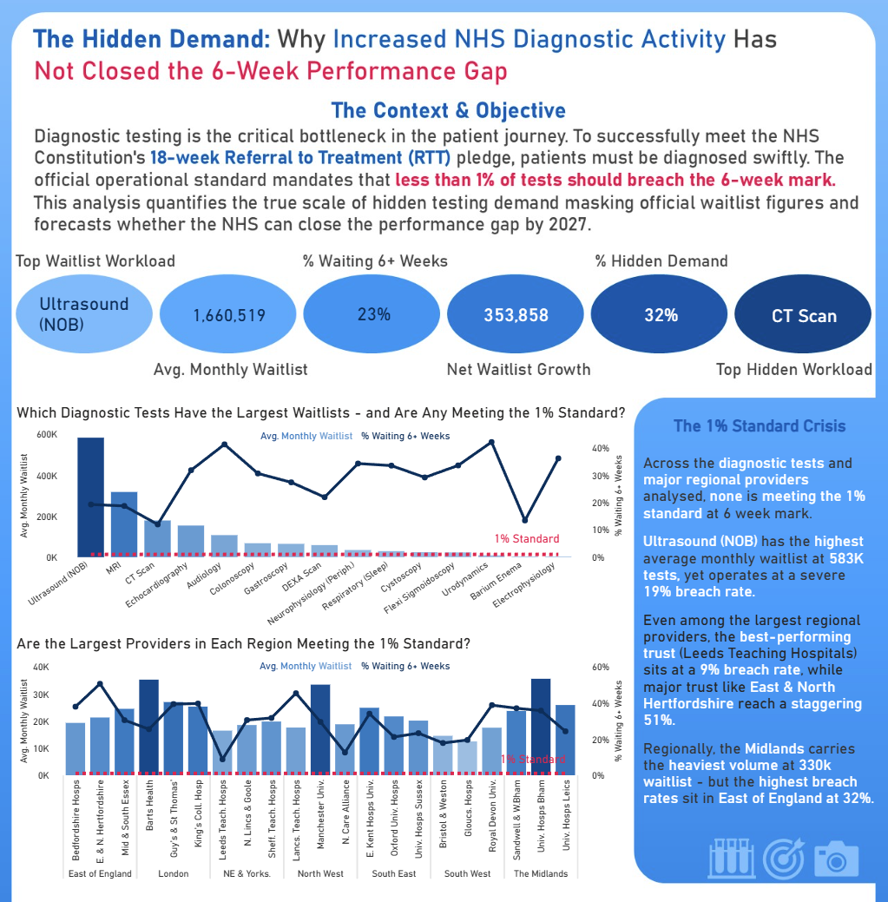
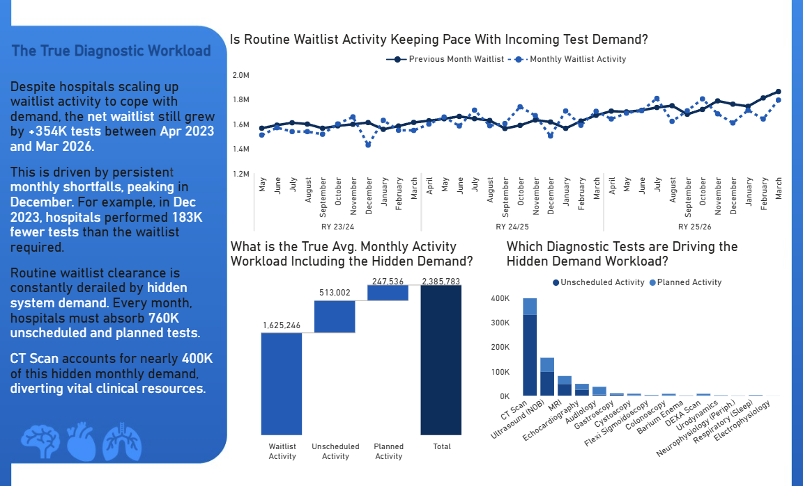
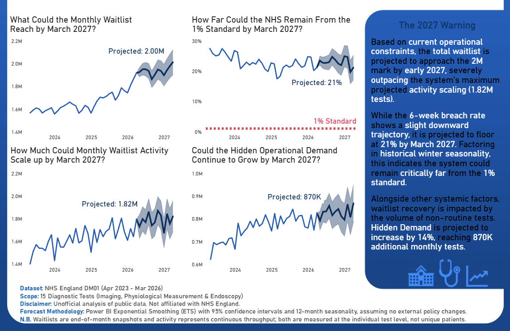

# NHS Diagnostic Waiting Times and Activity Infographic


## Project Overview

This project analyses **NHS England DM01 diagnostic waiting times and activity data** to explain why increased diagnostic activity has not closed the gap against the 6-week performance standard.

The infographic was built in **Microsoft Power BI** using a star schema data model, Power Query transformations, and DAX measures. The canvas background was designed in **PowerPoint** and imported into Power BI, with all charts, KPI cards, and reference lines built natively in Power BI on top of it.

The output is a **static, single-page vertical infographic** rather than an interactive dashboard. It is designed to be read top-to-bottom as a narrative: headline KPIs, then the performance failure, then the hidden workload driving it, then a 12-month forecast.

The aim of this project was to quantify the true scale of hidden diagnostic demand masking official waitlist figures, and to forecast whether the NHS can close the performance gap by 2027.

---

## Business Questions

The main business question for this project was:

**Why has increased NHS diagnostic activity not closed the 6-week performance gap?**

Supporting questions explored in the infographic:

* Which diagnostic tests carry the largest waitlists, and are any meeting the 1% standard?
* Are the largest providers in each region meeting the 1% standard?
* Is routine waitlist activity keeping pace with incoming test demand?
* What is the true monthly activity workload when hidden demand is included?
* Which diagnostic tests are driving the hidden demand workload?
* Where could the waitlist, breach rate, activity, and hidden demand be by March 2027?

---

## Data Gathering and Sources

* **Source:** NHS England Monthly Diagnostic Waiting Times and Activity (DM01) published data.
* **Period:** April 2023 – March 2026 (36 months, three complete NHS reporting years: 2023/24, 2024/25, 2025/26).
* **Scope:** 15 mandated diagnostic tests across 3 clinical categories — **Imaging**, **Physiological Measurement**, and **Endoscopy**.
* **Views collected:** Both the **Provider** view (organisations performing the tests) and the **Commissioner** view (ICBs funding care for a geographic population) were compiled into two consolidated Excel files.

### Why the analysis starts in April 2023

DM01 data is published well before 2023, and a longer history would normally strengthen a time series analysis. The window was deliberately restricted for a reason: **COVID-19 introduces a structural break in this dataset that cannot be modelled around.**

* Diagnostic activity collapsed in 2020 and recovered unevenly over the following years.
* The 6-week operational standard was effectively suspended during the pandemic period, so breach rates from those years do not measure the same thing as breach rates today.
* NHS England's own commentary flags the pandemic disruption when interpreting historical DM01 trends.

Fitting a seasonal forecast across that break would mean learning a seasonal component partly from pandemic conditions and projecting it onto a recovered system — the model would be extrapolating a pattern that no longer exists.

Starting in **April 2023** buys a clean, structurally consistent series in which every month is governed by the same operational regime. The cost is a shorter history: three seasonal cycles rather than five or six. That trade was accepted deliberately — a shorter homogeneous series is a better basis for forecasting than a longer one containing a regime change.

The window also aligns exactly with the NHS reporting cycle, giving three complete April–March reporting years with no partial years to distort annual comparisons.

Before any modelling, the official NHS **guidance and FAQ documents** were reviewed to build domain context. Key context established at this stage:

* Diagnostic tests should be completed within 6 weeks so the wider **18-week Referral to Treatment (RTT)** pledge can be met.
* The official operational standard is that **less than 1% of tests should breach the 6-week mark**.
* The waiting list is an **end-of-month snapshot**, while activity is **continuous monthly throughput**.
* Activity is recorded in three streams: **waiting list**, **unscheduled** (emergency), and **planned**.
* Volumes are recorded at the **individual test level, not unique patient pathways** — one patient may be waiting for, or receive, multiple tests.

### Provider vs Commissioner: the analytical decision

Both views were loaded into the model, but the **Provider view was chosen as the analytical basis** for the infographic because it measures the physical operational capacity and pressure of hospitals themselves.

Profiling the two views confirmed the grand totals matched exactly while regional buckets differed — evidence of **cross-border patient flow**. For example, the East of England commissioner waitlist exceeded its provider waitlist, indicating patients registered in the region were travelling elsewhere for tests, while the South East showed the opposite pattern. The Commissioner tables remain in the model for completeness but are not used in the final visuals.

---

## Data Model

The model is a **star schema** with 7 core tables plus 2 supporting tables:

| Table | Type | Purpose |
| --- | --- | --- |
| `Fact_Provider` | Fact | Provider-level waitlist and activity (analytical basis of the infographic) |
| `Fact_Commissioner` | Fact | Commissioner (ICB) level waitlist and activity, retained for context |
| `Dim_Date` | Dimension | Continuous daily calendar, marked as the official date table |
| `Dim_Diagnostic_Test` | Dimension | 15 tests flattened with their 3 parent categories |
| `Dim_Provider` | Dimension | Provider ODS codes and hospital names |
| `Dim_Commissioner` | Dimension | ICB codes and names |
| `Dim_Region` | Dimension | Regional teams, appended across both fact tables |
| `_Measures` | Measures table | Central home for all DAX measures |
| `_Waterfall Categories` | Disconnected table | Drives the activity waterfall chart |

Design decisions:

* **Star schema over snowflake.** The 15 tests and their 3 categories were flattened into a single `Dim_Diagnostic_Test` table rather than split into category/subcategory tables. With only 15 rows, the storage saving of normalisation is negligible while the performance and usability benefit of a single filter hop is real.
* **Dedicated `Dim_Date`** despite monthly-grain data, because DAX time intelligence functions require a contiguous daily calendar.
* **Shared `Dim_Region`** built by referencing both fact tables, appending them, and deduplicating — so the region dimension is comprehensive across both views.
* **Dedicated measures table** (`_Measures`) so measures are not scattered across fact tables.

---

## Power Query Work

### Fact table transformations

* **Removed pre-aggregated total rows.** Diagnostic ID 16 represents a pre-calculated total per provider/ICB. These rows were filtered out (`Table.SelectRows` with `[Diagnostic ID] <> 16`) to prevent double counting. This could not be done positionally, as providers offering a limited test range do not produce a total on a predictable row.
* **Built a proper date column.** The separate `Month` and `Year` columns were merged into a single string and converted to a Date type.
* **Anchored dates to end of month.** Because the waiting list is an end-of-month snapshot and activity accrues across the month, dates were shifted using **Transform → Date → Month → End of Month** rather than defaulting to the 1st.
* **Full-dataset column profiling** was enabled so data quality checks reflected all rows rather than the default 1,000-row preview.

### Dimension table construction

Dimensions were built using the **Reference and deduplicate** method rather than duplicating queries or importing separate files, so the engine reuses the cleaned fact output instead of reprocessing the source files:

1. Reference the cleaned fact query.
2. Remove other columns to keep only the dimension attributes.
3. Remove duplicates on the key column.
4. Rename and load.

### Data quality issues resolved

* **Provider code duplication.** 479 distinct provider codes against 462 unique values — around 17 codes appeared multiple times because the provider name was submitted inconsistently across the three years (a slowly changing dimension). Deduplicating on **both** columns failed, since Power Query treats the full row as one string. The fix was **targeted deduplication on `Provider Code` only**, preceded by `Trim` and `Capitalize Each Word` on the name column.
* **Multiple codes for the same hospital.** Duchy Hospital and Circle Reading Hospital each appeared under two ODS codes. These were deliberately **left unmodified** — overwriting them would alter the historical reality of how the organisation submitted data. The star schema still resolves correctly because the relationship is built on the code, and Power BI groups the identical display names when aggregating.
* **Region mismatch between views.** Providers have 7 regions; commissioners have 8, the extra being `X24 NHS England` (the central body directly commissioning specialised services, armed forces, and health & justice care). NHS England commissions but does not perform tests, so it never appears in provider data. `Dim_Region` was built by appending both region lists and deduplicating so neither relationship breaks.

### Label refinement for the static canvas

Because the infographic is static, truncated and slanted axis labels could not be resolved by user interaction. Two refined display columns were created via **Conditional Column** and **Replace Values**, keeping the raw names intact for auditability:

* `Diagnostic Test Name Refined` — e.g. Magnetic Resonance Imaging → **MRI**, Computed Tomography → **CT Scan**, Non-obstetric ultrasound → **Ultrasound (NOB)**, Neurophysiology - Peripheral neurophysiology → **Neurophysiology (Periph.)**.
* `Provider Name Refined` and `Regional Team Name Refined` — e.g. East and North Hertfordshire → **E. & N. Hertfordshire**, Northern Lincolnshire and Goole → **N. Lincs & Goole**, North East and Yorkshire → **NE & Yorks.**

---

## DAX Measures

### Date table

```dax
Dim_Date =
ADDCOLUMNS (
    CALENDAR ( DATE(2023, 1, 1), DATE(2026, 12, 31) ),
    "Year", YEAR([Date]),
    "Month Number", MONTH([Date]),
    "Month Name", FORMAT([Date], "MMMM"),
    "Short Month", FORMAT([Date], "MMM"),
    "Year Month", FORMAT([Date], "MMM YYYY"),
    "Year Month Sort", YEAR([Date]) * 100 + MONTH([Date]),
    "Reporting Month Number", IF ( MONTH([Date]) >= 4, MONTH([Date]) - 3, MONTH([Date]) + 9 ),
    "Reporting Year",
        IF (
            MONTH([Date]) >= 4,
            YEAR([Date]) & "/" & RIGHT( YEAR([Date]) + 1, 2 ),
            YEAR([Date]) - 1 & "/" & RIGHT( YEAR([Date]), 2 )
        )
)
```

Full calendar years were generated rather than only the data span, so advanced time intelligence does not break at the boundaries. The reporting year runs April–March to match the NHS operational cycle; it is deliberately **not** called a financial year, since this is operational rather than budget data. `Year Month Sort` forces chronological rather than alphabetical sorting.

### Volume and performance

```dax
Average Monthly Waitlist =
AVERAGEX (
    VALUES ( 'Dim_Date'[Date] ),
    CALCULATE ( SUM ( Fact_Provider[Total Waiting List] ) )
)
```

```dax
% Waiting at 6+ weeks =
DIVIDE (
    SUM ( Fact_Provider[Number waiting 6+ Weeks] ),
    SUM ( Fact_Provider[Total Waiting List] ),
    "-"
)
```

```dax
% Waiting at 13+ weeks =
DIVIDE (
    SUM ( Fact_Provider[Number waiting 13+ Weeks] ),
    SUM ( Fact_Provider[Total Waiting List] ),
    "-"
)
```

```dax
% Diagnostic Test Waitlist Contribution =
VAR CurrentWaitlist = SUM ( Fact_Provider[Total Waiting List] )
VAR TotalWaitlistAllTests =
    CALCULATE (
        SUM ( Fact_Provider[Total Waiting List] ),
        ALL ( Dim_Diagnostic_Test )
    )
RETURN
    DIVIDE ( CurrentWaitlist, TotalWaitlistAllTests, "-" )
```

```dax
Total Waitlist Growth =
VAR StartWaitlist =
    CALCULATE ( SUM ( Fact_Provider[Total Waiting List] ), 'Dim_Date'[Date] = DATE(2023, 4, 30) )
VAR EndWaitlist =
    CALCULATE ( SUM ( Fact_Provider[Total Waiting List] ), 'Dim_Date'[Date] = DATE(2026, 3, 31) )
RETURN
    EndWaitlist - StartWaitlist
```

```dax
1% Target = 0.01
```

### Supply vs demand

```dax
Previous Month Waitlist =
CALCULATE (
    SUM ( Fact_Provider[Total Waiting List] ),
    DATEADD ( 'Dim_Date'[Date], -1, MONTH )
)
```

```dax
Clearance Gap = [Waitlist Activity] - [Previous Month Waitlist]
```

```dax
Avg Monthly Clearance Gap =
AVERAGEX (
    FILTER (
        VALUES ( 'Dim_Date'[Year Month Sort] ),
        NOT ISBLANK ( [Waitlist Activity] ) && NOT ISBLANK ( [Previous Month Waitlist] )
    ),
    [Clearance Gap]
)
```

The `FILTER` wrapper trims boundary months where one side of the equation does not exist, so the average is taken only across mathematically valid months.

### Activity and hidden demand

```dax
Avg Waitlist Activity =
AVERAGEX (
    VALUES ( 'Dim_Date'[Year Month Sort] ),
    CALCULATE ( SUM ( Fact_Provider[Waiting list tests / procedures (excluding planned)] ) )
)

Avg Unscheduled Activity =
AVERAGEX (
    VALUES ( 'Dim_Date'[Year Month Sort] ),
    CALCULATE ( SUM ( Fact_Provider[Unscheduled tests / procedures] ) )
)

Avg Planned Activity =
AVERAGEX (
    VALUES ( 'Dim_Date'[Year Month Sort] ),
    CALCULATE ( SUM ( Fact_Provider[Planned tests / procedures] ) )
)
```

```dax
Avg Additional Demand = [Avg Unscheduled Activity] + [Avg Planned Activity]

Avg System Activity = [Avg Waitlist Activity] + [Avg Unscheduled Activity] + [Avg Planned Activity]

% Additional Demand = DIVIDE ( [Avg Additional Demand], [Avg System Activity], "-" )
```

```dax
Waterfall Total Activity =
SWITCH (
    SELECTEDVALUE ( '_Waterfall Categories'[Activity Type] ),
    "1. Waitlist",    SUM ( Fact_Provider[Waiting list tests / procedures (excluding planned)] ),
    "2. Unscheduled", SUM ( Fact_Provider[Unscheduled tests / procedures] ),
    "3. Planned",     SUM ( Fact_Provider[Planned tests / procedures] ),
    BLANK ()
)
```

The waterfall chart required a **disconnected table** (`_Waterfall Categories`) on the category axis, with a `SWITCH` measure resolving which activity stream to return — Power BI's waterfall visual only accepts a single field in the Y-axis, so three separate measures could not be stacked directly.

### Ranking and dynamic text

```dax
Most Popular Test =
CALCULATE (
    MAX ( 'Dim_Diagnostic_Test'[Diagnostic Test Name] ),
    TOPN ( 1, ALL ( 'Dim_Diagnostic_Test'[Diagnostic Test Name] ), [Average Monthly Waitlist], DESC )
)
```

```dax
Most Popular Additional Demand Test =
CALCULATE (
    MAX ( 'Dim_Diagnostic_Test'[Diagnostic Test Name] ),
    TOPN ( 1, ALL ( 'Dim_Diagnostic_Test'[Diagnostic Test Name] ), [Avg Additional Demand], DESC )
)
```

```dax
Provider Rank by Region =
RANKX (
    ALLSELECTED ( Dim_Provider[Provider Name] ),
    [Average Monthly Waitlist],
    ,
    DESC,
    Dense
)
```

`Provider Rank by Region` is applied as a visual-level filter (`<= 3`) to isolate the three largest providers **within each region**. Power BI's native Top N filter evaluates globally and would have returned the three largest hospitals in England overall, leaving most regional groups empty.

---

## Analytical Decisions and Assumptions

* **Averages, not three-year totals.** The waitlist is a **semi-additive** measure — summing 36 monthly snapshots produces a meaningless ~59.7M figure that double-counts tests still waiting across consecutive months. All volume metrics were rebuilt as **monthly averages** using `AVERAGEX` over the date dimension, so every figure on the infographic speaks the same language: the monthly operational grind.
* **Never average a percentage.** The source file contains a pre-calculated `% 6 week+` column. Aggregating it with `Average` would produce the average of ratios rather than the ratio of totals, which is mathematically wrong when providers differ in size. The percentage is recalculated from the raw numerator and denominator instead.
* **The cold-start boundary.** March 2023 does not exist in the dataset, so `Previous Month Waitlist` is blank for April 2023. This is expected; the supply-vs-demand line simply begins in May 2023, and the clearance gap average is filtered to valid months only.
* **Test level, not patient level.** All volumes count individual diagnostic tests. A patient may be waiting for more than one test simultaneously, so figures are not unique patient counts. All infographic wording was checked to keep terminology at the test/procedure level.
* **Snapshot vs throughput.** Waitlist volumes are end-of-month snapshots; activity volumes are continuous monthly throughput. This is why current-month activity is compared against the *previous* month's waitlist.
* **Provider basis.** All headline figures use the Provider view. Regional statements about provider performance reflect the **top 3 providers per region by waitlist size**, not every provider in that region.
* **Forecasts extrapolate historical behaviour only.** They assume no external policy change, no capacity intervention, and no further structural break. They are fitted on three seasonal cycles, which is the minimum viable basis for a seasonal model — the projections are best read as a directional trajectory with an interval, not as point predictions.

---

## Infographic Sections

### 1. Context, Headline KPIs, and the 1% Standard Crisis



Opens with a short primer explaining why diagnostic testing matters to the 18-week RTT pledge and what the 1% standard means, followed by six KPI pills:

| KPI | Value |
| --- | --- |
| Top Waitlist Workload | Ultrasound (NOB) |
| Avg. Monthly Waitlist | 1,660,519 |
| % Waiting 6+ Weeks | 23% |
| Net Waitlist Growth | 353,858 |
| % Hidden Demand | 32% |
| Top Hidden Workload | CT Scan |

Two line-and-clustered-column charts follow, both plotting average monthly waitlist as columns against the 6+ week breach rate as a line, with a red dashed constant line at the 1% standard:

* **By diagnostic test** — which tests carry the largest waitlists, and whether any meet the standard.
* **By provider, grouped by region** — the three largest providers in each of the 7 regions, filtered via `Provider Rank by Region`.

---

### 2. The True Diagnostic Workload



This section explains why activity growth has not translated into waitlist recovery:

* **Supply vs demand line chart** — current month waitlist activity plotted against the previous month's waitlist snapshot across all 36 months, exposing recurring monthly shortfalls.
* **Activity waterfall** — decomposes true average monthly workload into waitlist activity (1,625,246), unscheduled activity (513,002), and planned activity (247,536), totalling **2,385,783** tests per month.
* **Stacked column by test** — which diagnostic tests absorb the most unscheduled and planned activity.

---

### 3. The 2027 Warning (Forecast)



Four forecast line charts projecting 12 months ahead to March 2027, using Power BI's native **Exponential Smoothing (ETS)** forecast in the Analytics pane:

* Forecast length: **12 points** (one full reporting year)
* Seasonality: **12** (captures NHS winter seasonality)
* Ignore last: **0** (all three reporting years are complete)
* Confidence interval: **95%**

Projected metrics: monthly waitlist, % waiting 6+ weeks, monthly waitlist activity, and hidden operational demand.

#### Out-of-sample validation

The model was trained on data ending March 2026. NHS England has since published April, May, and June 2026, allowing the forecast to be tested against real data it never saw. It is benchmarked against a **naive persistence forecast** — the assumption that every future month simply equals the last observed value (March 2026, 1.92M). Beating naive is the standard bar in forecasting: a model that cannot outperform "assume nothing changes" is not earning its complexity.

| Month | Actual | ETS forecast | 95% interval | ETS error | Naive forecast | Naive error |
| --- | --- | --- | --- | --- | --- | --- |
| Apr 2026 | 1.94M | 1.92M | 1.88M – 1.96M | −1.0% | 1.92M | −1.0% |
| May 2026 | 1.90M | 1.95M | 1.90M – 2.00M | +2.6% | 1.92M | +1.1% |
| Jun 2026 | 1.92M | 1.95M | 1.90M – 2.00M | +1.6% | 1.92M | 0.0% |
| **MAE** | | | | **~1.7%** | | **~0.7%** |

*Published figures are rounded, so error percentages are approximate. Data for July 2026 had not been released at the time of writing.*

**What the validation shows:**

* **Interval coverage is sound.** All three actuals fall inside the 95% confidence bands, so the model's uncertainty estimate is honest rather than overconfident.
* **The naive baseline wins on point accuracy.** ETS ties in April and loses in May and June, with roughly 2.5× the mean absolute error of persistence. At a one-to-three-month horizon, this model does not beat doing nothing.
* **The point estimates lean high.** ETS over-predicted in two of three months and every actual sits in the lower half of its interval. The model learned an upward trend from the 2023–2026 training window, while the observed series has gone flat, oscillating around 1.92M across all three months.
* **Error compounds with horizon.** A three-month check does not validate a twelve-month projection. The widening confidence band in the charts is the model's own statement that March 2027 is a substantially weaker claim than June 2026.

**Implication for the 2027 projection.** Three months is not enough to declare a trend change — the flattening could be a genuine plateau, a seasonal effect, or noise. But it is enough to say the waitlist is currently tracking the **lower half of the forecast cone** rather than the centre. The 2M headline should be read as the upper end of a plausible range, not as a firm prediction.

A methodology footer runs beneath the section stating the dataset, scope, forecast method, the disclaimer that this is an unofficial analysis not affiliated with NHS England, and the snapshot-vs-throughput note.

---

## Key Findings

* **The 1% standard is universally missed.** Not a single diagnostic test category, and none of the largest regional providers analysed, met the 6-week standard at any point.
* **Volume and performance are separate problems.** Ultrasound (NOB) carries the highest average monthly waitlist at roughly 583K tests while running a 19% breach rate — high volume does not automatically mean the worst breach rate.
* **Provider performance varies enormously.** Among the largest providers in each region, breach rates ranged from 9% at Leeds Teaching Hospitals to 51% at East & North Hertfordshire.
* **Geography offers no protection.** The Midlands carries the heaviest regional volume at around 330K waitlist tests, while the East of England shows the highest regional breach rate at 32%.
* **Activity scaled up, but the backlog still grew.** The net waitlist grew by **+353,858 tests** between April 2023 and March 2026, driven by persistent monthly shortfalls that peak in December — in December 2023 hospitals performed 183K fewer tests than the previous month's waitlist required.
* **Hidden demand is the structural bottleneck.** Roughly **760K unscheduled and planned tests** are absorbed every month on top of routine waitlist clearance, meaning **32%** of all diagnostic activity never appears in waitlist clearance figures. CT Scan alone accounts for nearly 400K of that hidden monthly workload.
* **The forecast is not encouraging, but should be read as a range.** On the modelled trajectory the monthly waitlist approaches the **2M** mark by early 2027, outpacing the maximum projected activity scaling of around **1.82M** — the persistent gap between demand and capacity matters more here than the exact figures. The breach rate improves but floors at roughly **21%**, still some 20 points above the standard. Hidden demand is projected to grow a further **14%** to around **870K** monthly tests. Out-of-sample testing against April–June 2026 (see the forecast section) shows the waitlist currently tracking the lower half of the forecast cone, so 2M is best treated as the upper end of a plausible range.

**The overall story:** hospitals are becoming more efficient at processing tests, but they are losing the war against sheer volume. The breach rate is falling while the absolute waitlist grows — and the hidden demand consuming a third of all diagnostic capacity is the reason increased activity has not closed the performance gap.

---

## Design and Build Approach

* Canvas designed in **PowerPoint** and exported as a background image, keeping the Power BI file lightweight and avoiding dozens of shape visuals.
* **NHS Blue (#005EB8)** and its tints used as the base palette, with red reserved exclusively as the alert colour for the 1% standard reference lines and breach messaging.
* Layout follows a **three-tier vertical narrative**: hook and headline KPIs → the hidden workload explanation → forecast and warning.
* Charts and KPI cards built natively in Power BI and positioned into designated zones on the imported background.
* Each chart is titled as a **question**, so the reader knows what to look for before reading the visual.
* Executive summary blocks sit alongside each section to carry the narrative for a reader who does not read the charts in detail.

---

## Files Included

| File | Description |
| --- | --- |
| `NHS_Diagnostic_Waiting_Times_and_Activity_Infographic_Final.pbix` | Power BI file containing the data model, Power Query transformations, DAX measures, and final infographic. |
| `pbi1-infographic-preview.png` | Full infographic preview image. |
| `pbi1-infographic-top.png` | Section 1 — context, headline KPIs, and the 1% standard crisis. |
| `pbi1-infographic-middle.png` | Section 2 — the true diagnostic workload and hidden demand. |
| `pbi1-infographic-bottom.png` | Section 3 — the 2027 forecast and warning. |

---

## Disclaimer

Unofficial analysis of publicly available NHS England DM01 data. Not affiliated with or endorsed by NHS England. All volumes represent individual diagnostic tests, not unique patient pathways. Forecasts assume no external policy changes.

---

## Project Status

Completed Project 3 of 5.
